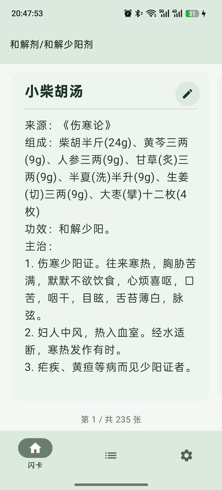
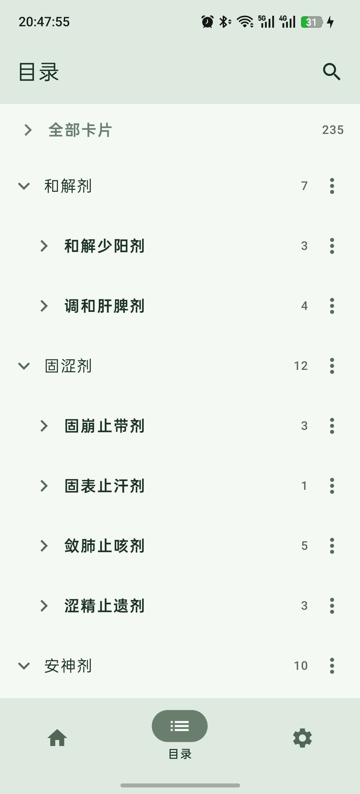
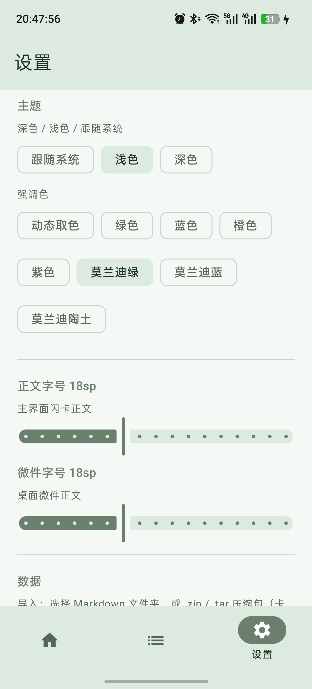

# 知识闪卡（KnowledgeCards）

> 安卓离线知识卡片应用：把 Markdown 文件夹变成可滑动的知识卡片，带桌面微件。
> **KnowledgeCards — an offline Android flashcard app for Markdown knowledge bases.**

把一批约 150 字的文本卡片（如方剂学知识：来源/组成/功效/主治）按文件夹分类整理，导入后即可左右滑动复习，并可通过桌面微件直接查看当前卡片。

- 🚫 无广告 · 无网络权限 · 纯本地离线
- 📱 中文界面，适配深色模式与多色主题

## 截图

| 闪卡浏览 | 目录管理 |
|---|---|
|  |  |
| **设置** | **桌面微件** |
|  |  |

## 功能

| 模块 | 能力 |
|---|---|
| **闪卡浏览** | 左右滑动翻卡；目录顺序浏览（与目录页一致）；重启/微件联动恢复进度；完整路径展示 |
| **闪卡集** | 目录页选中某个分类后，闪卡页只浏览该分类的卡片 |
| **目录** | 多级分类树（展开动效）；卡组上移/下移/重命名/删除；**全库检索**（目录+卡片，命中高亮定位） |
| **导入** | SAF 选择文件夹递归导入 `.md`；支持 `.zip` / `.tar` 压缩包；按「路径+标题」判重，重复导入自动更新 |
| **导出** | 按分类生成文件夹结构的 .md 备份，可再次导入 |
| **编辑** | 修改标题/正文/分类（含新建分类） |
| **设置** | 主题（跟随系统/浅色/深色）、8 套强调色、正文字号/微件字号、导入导出入口 |
| **桌面微件** | 半透明圆角面板；展开/收起完整路径；正文可滚动；上一张/下一张按钮；与 App 实时双向同步 |

## 使用场景

以中医药方剂学为例：把教材内容用 AI 转写为每张约 150 字的卡片

```
方剂学/
├── 解表剂/
│   ├── 麻黄汤.md      ← # 麻黄汤
│   └── 桂枝汤.md        来源：…
├── 和解剂/              组成：…
└── 固涩剂/              功效：…
                         主治：…
```

## 导入格式

- 一个 `.md` 文件 = 一张卡片
- **分类 = 文件所在文件夹的层级**（`解表剂/辛温解表/麻黄汤.md` → 分类「解表剂/辛温解表」）
- 标题：文件名；文件内第一个非空行为 `# 标题` 时以文件内为准
- 正文：其余所有行

## 构建

- 环境：JDK 17+、Android SDK；本仓库不含本机路径，JDK 通过 `JAVA_HOME` 指定
- 设备要求：**Android 16（API 36）及以上**（minSdk 36）

```bash
./gradlew :app:assembleDebug   # 构建 debug APK（约 40MB）
./gradlew :app:installDebug    # 安装到已连接设备
./gradlew :app:assembleRelease # 构建发布版 APK（R8 裁剪，约 5MB）
```

单元测试：`./gradlew :app:testDebugUnitTest`

## 技术栈

Kotlin · Jetpack Compose (Material 3) · Room · DataStore · Glance（桌面微件）· SAF（零存储权限）

## 隐私

应用不申请网络权限，所有数据（卡片、设置、进度）仅存储在本机。

## 许可证

[GPL-3.0-only](LICENSE)

---

开发者文档（架构、导入规范、踩坑记录）见 [docs/开发者文档.md](docs/开发者文档.md)。
